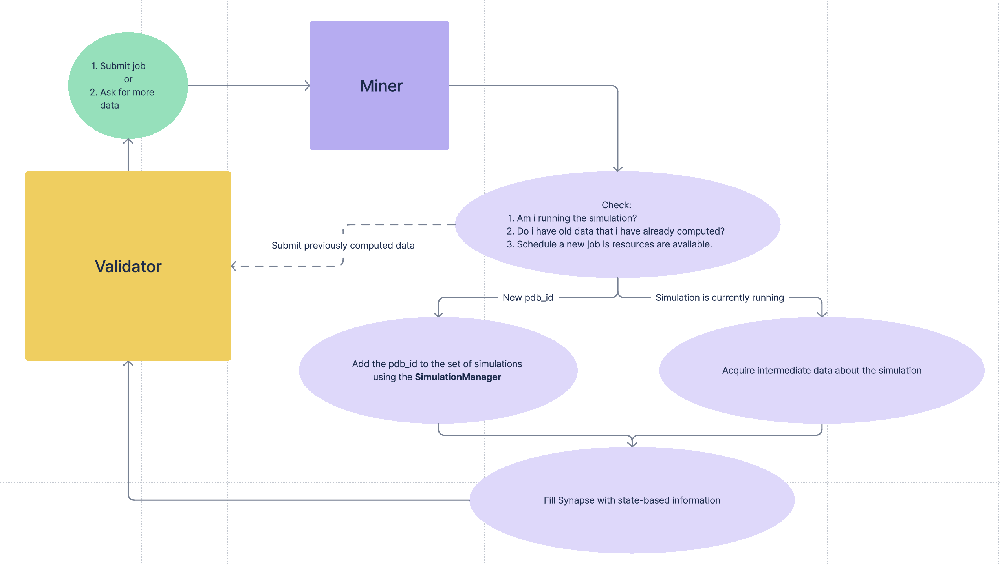

# Mining Procedure
With the introduction of OpenMM, clients are now required to use GPU hardware for energy minimization simulations. Protein folding is a computationally intensive task. There are no shortcuts, and as such clients are rewarded truly on their ability to find the best configuration for their protein. 

With the removal of CPU-based clients, participants are encouraged to explore the trade-off between parallell processing and dedicating all compute power to a single simulation. Limiting the number of active simulations allows clients to focus on finding the best configuration for a single protein without the overhead of managing multiple tasks.

## Job Scheduling

    

The validator rewards clients by checking what each client's intermediate results are for a specific pdb job. The faster you can find the best solution, the more likely you are to recieve rewards on each query step. 